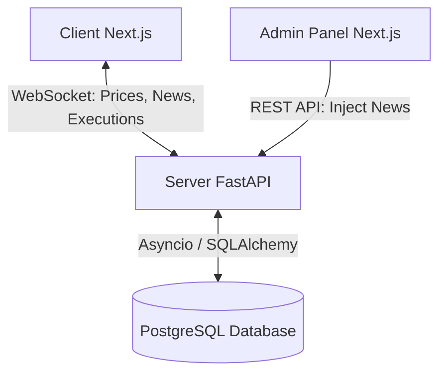

# System Architecture: simtrade

## 1. High-Level System Diagram

The system follows an event-driven client-server architecture with a centralized tick loop pushing state to connected clients.

## 2. The "Tick Loop" Pipeline

The heart of simtrade is the internal Python Asyncio loop running inside FastAPI. It executes precisely every 1.0 seconds:

1.  **Read State:** The loop checks the database or in-memory cache for any active "News Events" injected by the Admin.
2.  **Calculate Price:** 
    *   *Default:* Apply the Random Walk algorithm (e.g., Previous Price + Gaussian Noise).
    *   *Override:* If an active News Event exists (e.g., "Market Crash"), heavily bias the price calculation downwards.
3.  **Resolve PnL:** Calculate the current unrealized PnL for all active portfolios based on the new tick price.
4.  **Update Leaderboard:** Sort users based on total portfolio value (Fiat + Unrealized PnL).
5.  **Broadcast:** Construct a JSON payload containing the new tick, leaderboard, and news status, and push it to all connected WebSocket clients.

## 3. Database Schema Layout (PostgreSQL)

### `Users`
* `id` (UUID, Primary Key)
* `username` (String, Unique)
* `role` (Enum: Participant, Admin)
* `created_at` (Timestamp)

### `Assets` (For the MVP, maybe just 1 synthetic asset like $SIM)
* `id` (UUID, Primary Key)
* `symbol` (String, Unique)
* `name` (String)

### `Portfolios` (Current State - optionally derived from Transactions)
* `id` (UUID, Primary Key)
* `user_id` (UUID, Foreign Key)
* `fiat_balance` (Decimal)
* `asset_quantity` (Decimal)

### `Transactions` (The Immutable Ledger)
* `id` (UUID, Primary Key)
* `user_id` (UUID, Foreign Key)
* `asset_id` (UUID, Foreign Key)
* `type` (Enum: BUY, SELL)
* `quantity` (Decimal)
* `price_per_unit` (Decimal)
* `total_cost` (Decimal)
* `timestamp` (Timestamp)

### `News_Events` (Scenario Engine)
* `id` (UUID, Primary Key)
* `title` (String)
* `sentiment` (Enum: BULLISH, BEARISH, CRASH, MOON)
* `magnitude` (Float)
* `is_active` (Boolean)
* `created_at` (Timestamp)
