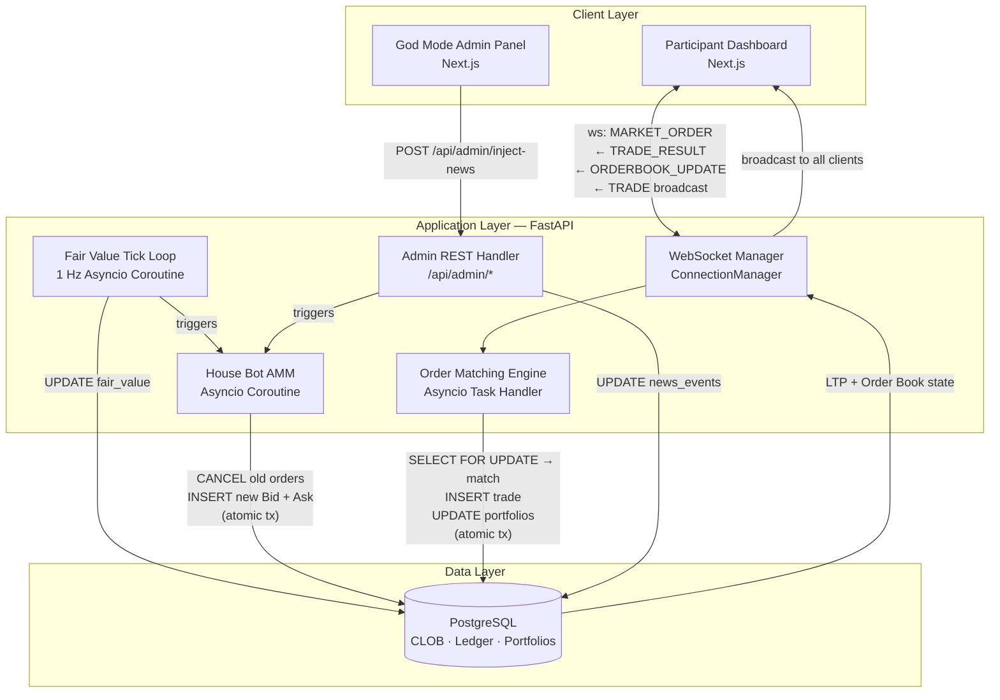

# System Architecture: Synthex
**Version:** 2.0 — AMM / CLOB Architecture  
**Classification:** Internal — Engineering  
**Status:** Active

---

## 1. High-Level System Diagram

---

## 2. The New Pipeline: From Tick to Broadcast

The heart of Synthex is a cascading, event-driven pipeline that replaces the old direct price-feed model. Each 1-second cycle executes the following **strictly ordered sequence**:

### Step 1 — Fair Value Computation (The Hidden Oracle)
The `fair_value_tick_loop` coroutine runs every 1.0 seconds via `asyncio.sleep(1)`.

- **Default:** `new_fair_value = previous_fair_value + gaussian_noise(μ=0, σ=volatility_param)`
- **News Override:** If an active `news_event` exists with a signed `magnitude` modifier, apply: `new_fair_value = previous_fair_value × (1 + magnitude)`. A "Market Crash" event uses a large negative magnitude (e.g., `-0.08` to `-0.15`).
- The new Fair Value is **persisted to PostgreSQL** (`market_state` table) and is **never transmitted to any client**.

### Step 2 — House Bot Re-Quote (AMM Liquidity Provision)
The Fair Value tick immediately triggers the `house_bot_requote` coroutine.

- The Bot reads the just-committed Fair Value from the DB.
- It executes an **atomic cancel-and-replace** transaction:
  1. `UPDATE orders SET status='CANCELLED' WHERE owner='HOUSE_BOT' AND status='OPEN'`
  2. `INSERT INTO orders ... ('BID', fair_value - half_spread, qty, 'OPEN')`
  3. `INSERT INTO orders ... ('ASK', fair_value + half_spread, qty, 'OPEN')`
- The spread (`half_spread`) is a configurable parameter (e.g., `0.50` per unit by default; significantly wider during a news event to model liquidity withdrawal).

### Step 3 — Order Matching (Human Market Orders)
This step is **event-driven**, not tick-driven. It fires whenever the WebSocket Manager receives a `MARKET_ORDER` message from a participant.

- The `order_matching_engine` opens a DB transaction with `SELECT ... FOR UPDATE NOWAIT` on the best available House Bot Limit Order.
- On successful match:
  1. Inserts a record into the `trades` table (the immutable ledger).
  2. Updates `orders` (sets matched order to `FILLED`).
  3. Atomically adjusts both parties' `portfolios` rows.
- The matched trade's `price` and `timestamp` become the new **Last Traded Price (LTP)**.

### Step 4 — Post-Match Broadcast (State Dissemination)
Immediately following a successful match (or following each House Bot re-quote), the WebSocket Manager broadcasts **two distinct message types** to all connected clients:

1. **`trade` message** — carries the LTP from the just-executed match.
2. **`orderbook_update` message** — carries the current best Bid and best Ask from the live CLOB state.

The leaderboard recalculation uses the latest LTP as the mark-to-market price for all open positions.

---

## 3. Database Schema (PostgreSQL)

### `users`
| Column | Type | Notes |
|---|---|---|
| `id` | UUID PK | |
| `username` | VARCHAR UNIQUE | |
| `role` | ENUM(`PARTICIPANT`, `ADMIN`, `HOUSE_BOT`) | |
| `created_at` | TIMESTAMPTZ | |

### `assets`
| Column | Type | Notes |
|---|---|---|
| `id` | UUID PK | |
| `symbol` | VARCHAR UNIQUE | e.g., `SIM` |
| `name` | VARCHAR | e.g., `Synthex Coin` |

### `market_state`
| Column | Type | Notes |
|---|---|---|
| `id` | UUID PK | Single-row table for MVP |
| `asset_id` | UUID FK | |
| `fair_value` | NUMERIC(18,6) | Hidden oracle price; never exposed to clients |
| `last_traded_price` | NUMERIC(18,6) | LTP from last matched trade |
| `updated_at` | TIMESTAMPTZ | |

### `orders` (The Central Limit Order Book)
| Column | Type | Notes |
|---|---|---|
| `id` | UUID PK | |
| `owner_id` | UUID FK → `users.id` | `HOUSE_BOT` user for AMM orders |
| `asset_id` | UUID FK | |
| `side` | ENUM(`BID`, `ASK`) | |
| `order_type` | ENUM(`LIMIT`, `MARKET`) | House Bot always posts `LIMIT`; humans submit `MARKET` |
| `price` | NUMERIC(18,6) | NULL for MARKET orders |
| `quantity` | NUMERIC(18,6) | CHECK > 0 |
| `status` | ENUM(`OPEN`, `FILLED`, `CANCELLED`) | |
| `created_at` | TIMESTAMPTZ | |
| `filled_at` | TIMESTAMPTZ | NULL until matched |

*Index:* `(asset_id, side, status, price)` — supports fast best-Bid/best-Ask lookups.

### `trades` (The Immutable Execution Ledger)
| Column | Type | Notes |
|---|---|---|
| `id` | UUID PK | |
| `asset_id` | UUID FK | |
| `buyer_id` | UUID FK → `users.id` | |
| `seller_id` | UUID FK → `users.id` | Usually `HOUSE_BOT` |
| `matched_order_id` | UUID FK → `orders.id` | The Limit Order that was filled |
| `price` | NUMERIC(18,6) | The LTP for this trade |
| `quantity` | NUMERIC(18,6) | |
| `total_value` | NUMERIC(18,6) | `price × quantity` |
| `executed_at` | TIMESTAMPTZ | |

*Append-only. No UPDATE or DELETE ever issued on this table.*

### `portfolios`
| Column | Type | Notes |
|---|---|---|
| `id` | UUID PK | |
| `user_id` | UUID FK UNIQUE | One portfolio per user |
| `fiat_balance` | NUMERIC(18,6) | CHECK ≥ 0 |
| `asset_quantity` | NUMERIC(18,6) | CHECK ≥ 0 |

### `news_events`
| Column | Type | Notes |
|---|---|---|
| `id` | UUID PK | |
| `title` | VARCHAR | Headline shown to participants |
| `sentiment` | ENUM(`BULLISH`, `BEARISH`, `CRASH`, `MOON`) | |
| `magnitude` | FLOAT | Signed multiplier applied to Fair Value |
| `duration_seconds` | INTEGER | |
| `is_active` | BOOLEAN | Polled by Tick Loop |
| `created_at` | TIMESTAMPTZ | |
| `expires_at` | TIMESTAMPTZ | Computed on insert |
